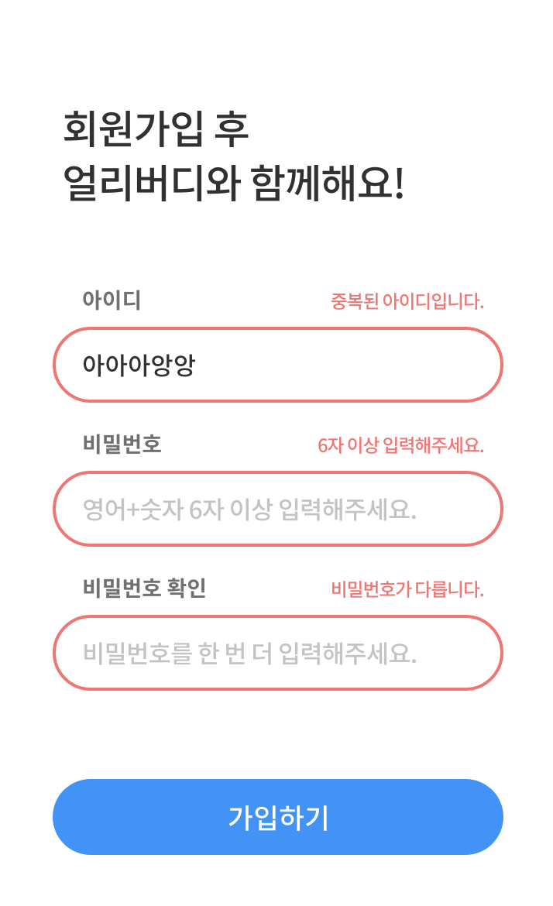
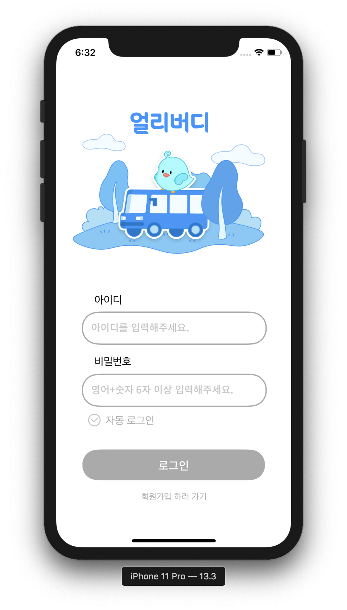
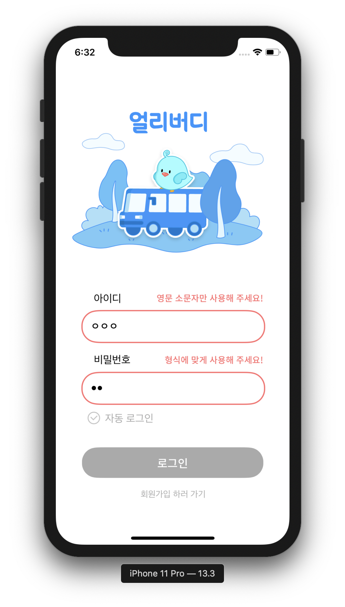
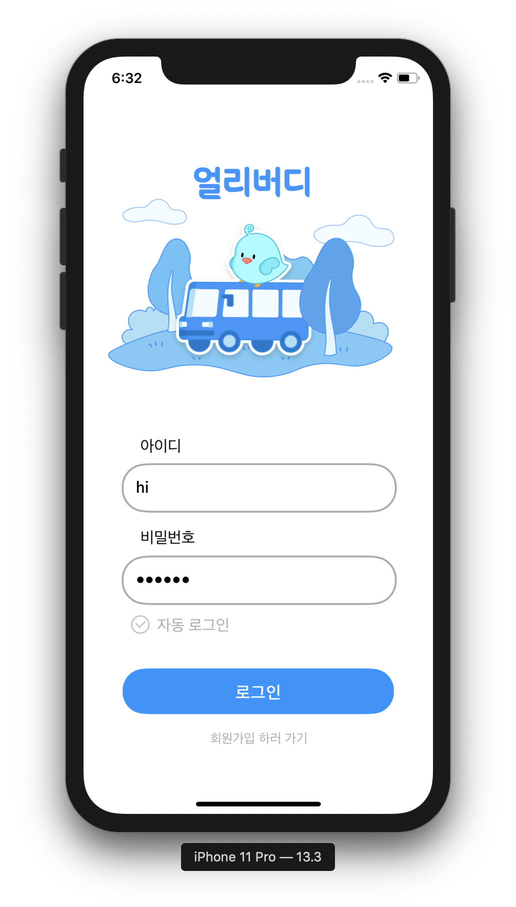
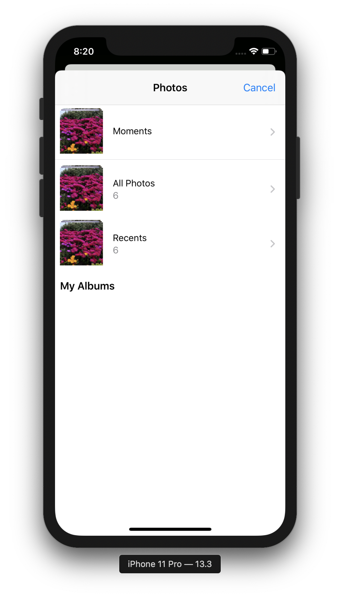
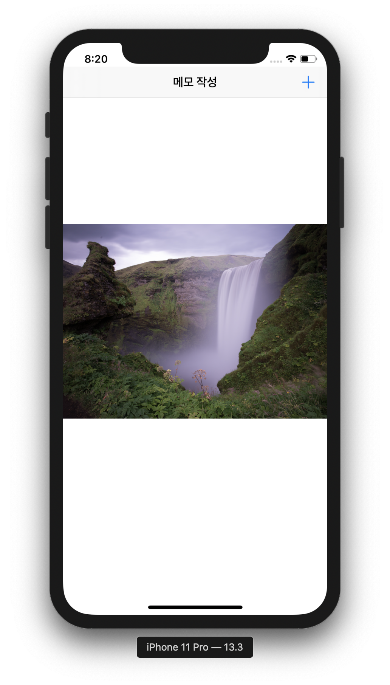
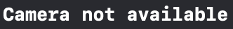

# iOS 스터디

### 일정 및 주제

| 주차  |          주제           | 출석 |
| :---: | :---------------------: | :--: |
| 1주차 |       유효성 검사       |  😓   |
| 2주차 | 유효성 검사 in 얼리버디 |  ☺️   |
| 3주차 |     이미지 불러오기     |  🤗   |

------

### 유효성 검사 in 얼리버디

유효성 검사는 정규 표현식을 사용해서 구현했다.

* 제플린에 나와있는 유효성 예시

</img>
  
  아이디 : 영문 소문자로만 1자리 이상 <br><br>
  비밀번호 : 영문 소문자와 숫자 포함 6자리 이상

* 실제 구현 뷰 (로그인 뷰)

  </img>
  </img>
  </img>

  텍스트필드 딜리게이트를 extension해서 적용했다.

  ```swift
  extension LoginViewController : UITextFieldDelegate{
      func textFieldDidEndEditing(_ textField: UITextField) {
          if textField == idTextField {
              // 영문 소문자 1자리 이상
              textFieldCheck(idTextField, idContainerView, idErrorLabel, "^[a-z]{1,}$", "영문 소문자만 사용해 주세요!")
          } else if textField == pwTextField {
              // 영문 소문자 + 숫자 총 6자리 이상
              textFieldCheck(pwTextField, pwContainerView, pwErrorLabel, "^[a-z0-9]{6,}$", "형식에 맞게 사용해 주세요!")
          }
      }
      
      func textFieldCheck(_ tf: UITextField,_ cv: RoundedCornerView,_ errorLabel: UILabel,_ regex: String, _ alert: String) {
          if !textFieldNullCheck(tf,cv, errorLabel) {
          } else if !gsno(tf.text).hasCharacter(regex: regex) {
              // 컨테이너 뷰 빨간색으로 변경
              cv.setColor(.ff6E6E)
              errorLabel.text = alert
              errorLabel.textColor = .ff6E6E
          } else {
              cv.setColor(.lightGray)
              errorLabel.text = " "
          }
      }
      
      func textFieldNullCheck(_ tf: UITextField,_ cv: RoundedCornerView,_ label: UILabel) -> Bool {
          if tf.text == "" {
              // 컨테이너 뷰 빨간색으로 변경
              cv.setColor(.ff6E6E)
              label.text = "값을 입력해주세요"
              label.textColor = .ff6E6E
              return false
          } else { return true }
      }
      
      // 키보드 처리
      @objc func keyboardWillShow(notification: Notification) {
          self.view.frame.origin.y -= 50
      }
      
      @objc func keyboardWillHide(notification: Notification) {
          self.view.frame.origin.y = originY
      }
      
      override func viewWillAppear(_ animated: Bool) {
          registerForKeyboardNotifications()
          
      }
      
      override func viewWillDisappear(_ animated: Bool) {
          unregisterForKeyboardNotifications()
      }
      
      func registerForKeyboardNotifications() {
          NotificationCenter.default.addObserver(self, selector:#selector(keyboardWillShow), name: UIResponder.keyboardWillShowNotification, object: nil)
          NotificationCenter.default.addObserver(self, selector:#selector(keyboardWillHide), name: UIResponder.keyboardWillHideNotification, object: nil)
      }
      func unregisterForKeyboardNotifications() {
          NotificationCenter.default.removeObserver(self, name: UIResponder.keyboardWillShowNotification, object: nil)
          NotificationCenter.default.removeObserver(self, name: UIResponder.keyboardWillHideNotification, object: nil)
      }
      
      // 영역을 클릭하면 블루로 변경
      func textFieldDidBeginEditing(_ textField: UITextField) {
          if textField == idTextField {
              idContainerView.setColor(.mainblue)
          } else {
              if idContainerView.pathColor == .mainblue {
                  idContainerView.setColor(.lightGray)
              }
          }
          if textField == pwTextField {
              pwContainerView.setColor(.mainblue)
          } else {
              if pwContainerView.pathColor == .mainblue {
                  pwContainerView.setColor(.lightGray)
              }
          }
      }
      
      override func touchesBegan(_ touches: Set<UITouch>, with event: UIEvent?) {
          self.view.endEditing(true)
          if gsno(idTextField.text).hasCharacter(regex: "^[a-z]{1,}$") &&
              gsno(pwTextField.text).hasCharacter(regex: "^[a-z0-9]{6,}$") {
              loginButton.isEnabled = true
              loginButton.backgroundColor = .mainblue
          } else {
              loginButton.isEnabled = false
              loginButton.backgroundColor = .lightGray
          }
      }
  }
  ```

  ------

  ### 이미지 불러오기

  - 갤러리에서 이미지 불러오기
  </img>
    </img>
    </img>


  - 카메라에서 이미지 불러오기

     </img>
    > 시뮬레이터는 카메라 적용이 안되기 때문에 처리해줌


  - 갤러리와 카메라 사용은 UIImagePickerController를 사용

    ```swift
    // UIImagePickerController를 사용
    // picker의 딜리게이트 처리를 해주어야 함
    let picker = UIImagePickerController()
    
    override func viewDidLoad() {
            super.viewDidLoad()
            picker.delegate = self
    }
    ```

    ```swift
    // picker에서 이미지를 선택하면 UIImageView로 보여줌
    extension AddMemoViewController: UIImagePickerControllerDelegate, UINavigationControllerDelegate {
        
        func imagePickerController(_ picker: UIImagePickerController, didFinishPickingMediaWithInfo info: [UIImagePickerController.InfoKey : Any]) {
            if let image = info[UIImagePickerController.InfoKey.originalImage] as? UIImage {
                imageView.image = image
                print(info)
            }
            
            dismiss(animated: true, completion: nil)
        }
        
    }
    ```


  - 갤러리, 카메라 사용 함수들

    ```swift
    func openLibrary() {
      picker.sourceType = .photoLibrary
      present(picker, animated: false, completion: nil)
    }
    
    func openCamera() {
      if(UIImagePickerController .isSourceTypeAvailable(.camera)) {
        picker.sourceType = .camera
        present(picker, animated: false, completion: nil)
      }
    
      else {
        print("Camera not available")
      }
    }
    ```
